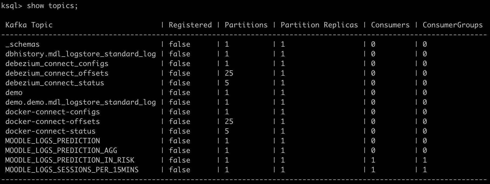
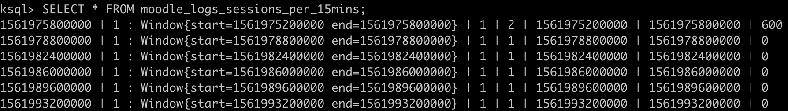
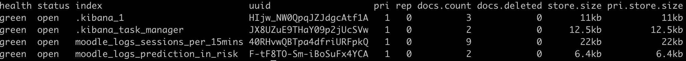
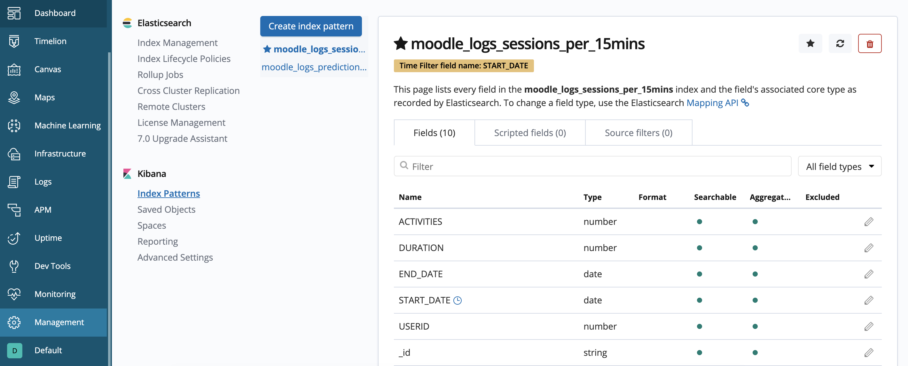
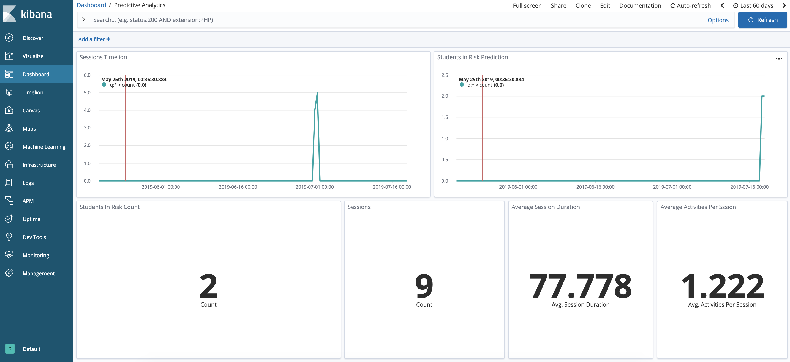

= Data analysis with Apache kafka and KSQL

In this project we’re going to see how we can take a stream of user sessions to make a student/user withdrawal predictions.
We're going to use kafka connect component to create an ETL solution to ingest data and KSQL to easly create streams of data.

== Run docker containers via docker compose

[source,bash]
----
    docker-compose up -d
----

This brings up the stack, and also loads the necessary Kafka Connect, Elasticsearch, and Kibana configuration.

== Launch the KSQL CLI
[source,bash]
----
    docker-compose exec ksql-cli bash -c 'echo -e "\n\n⏳ Waiting for KSQL to be available before launching CLI\n"; while [ $(curl -s -o /dev/null -w %{http_code} http://ksql-server:8088/) -eq 000 ] ; do echo -e $(date) "KSQL Server HTTP state: " $(curl -s -o /dev/null -w %{http_code} http://ksql-server:8088/) " (waiting for 200)" ; sleep 5 ; done; ksql http://ksql-server:8088'
----

Show topics:

[source,sql]
----
LIST TOPICS;
----

You should see topics:

Some of the topics are automatically created from the kafka connect sink scripts.

Declare stream and table related to user sessions:

Stream data is ingested automatically via Kafka Connect/Debezium from the mysql container into `demo.demo.mdl_logstore_standard_log` topic

== To see MySQL data launch MySQL CLI

[source,bash]
----
docker-compose exec mysql bash -c 'mysql -u $MYSQL_USER -p$MYSQL_PASSWORD demo'
----

[source,sql]
----
SELECT * FROM mdl_logstore_standard_log;
----

== Get back to KSQL CLI:

[source,sql]
----
SET 'auto.offset.reset' = 'earliest';

CREATE STREAM moodle_logs WITH (KAFKA_TOPIC='demo.demo.mdl_logstore_standard_log', VALUE_FORMAT='AVRO', TIMESTAMP='timecreated', KEY='id');
CREATE TABLE moodle_logs_sessions_per_15mins WITH (VALUE_FORMAT='JSON', PARTITIONS=1) AS SELECT userid, count(*) AS activities, WindowStart() AS start_date, WindowEnd() AS end_date, ((WindowEnd() - WindowStart())/1000) AS duration FROM moodle_logs WINDOW SESSION (15 minutes) GROUP BY userid;
----

Show user sessions:

[source,sql]
----
SELECT * FROM moodle_logs_sessions_per_15mins;
----

That should create 6 user sessions as below:

Create streams and tables related to prediction:

[source,sql]
----
CREATE TABLE moodle_logs_prediction_agg WITH (VALUE_FORMAT='JSON', PARTITIONS=1) AS SELECT userid, sum(activities) AS activities, sum(duration)/count(*) AS duration, count(*) AS sessions FROM moodle_logs_sessions_per_15mins GROUP BY userid;
CREATE STREAM moodle_logs_prediction(userid bigint, prediction double, created_date bigint) WITH (KAFKA_TOPIC='MOODLE_LOGS_PREDICTION', VALUE_FORMAT='JSON', TIMESTAMP='created_date');
CREATE STREAM moodle_logs_prediction_in_risk WITH (VALUE_FORMAT='JSON', PARTITIONS=1) AS SELECT * FROM moodle_logs_prediction WHERE prediction > 0.7;
----

== Insert new data via MySql

[source,bash]
----
docker-compose exec mysql bash -c 'mysql -u $MYSQL_USER -p$MYSQL_PASSWORD demo'
----

[source,mysql]
----
INSERT INTO mdl_logstore_standard_log(eventname, userid, timecreated) VALUES ('\\core\\event\\course_viewed', 2, 1561975200000);
INSERT INTO mdl_logstore_standard_log(eventname, userid, timecreated) VALUES ('\\core\\event\\course_viewed', 3, 1561975200000);
INSERT INTO mdl_logstore_standard_log(eventname, userid, timecreated) VALUES ('\\core\\event\\course_viewed', 3, 1561975300000);
----

== Check Elasticsearch indices

[source,bash]
----
    curl http://localhost:9200/_cat/indices?v
----

== Kibana Visualisation

http://localhost:5601/app/kibana#/management/kibana/objects?_g=()[Open Kibana and import dashboard (scripts/kibana-dashboard.json)]

Setup a default index pattern

You should see kibana dashboard like

